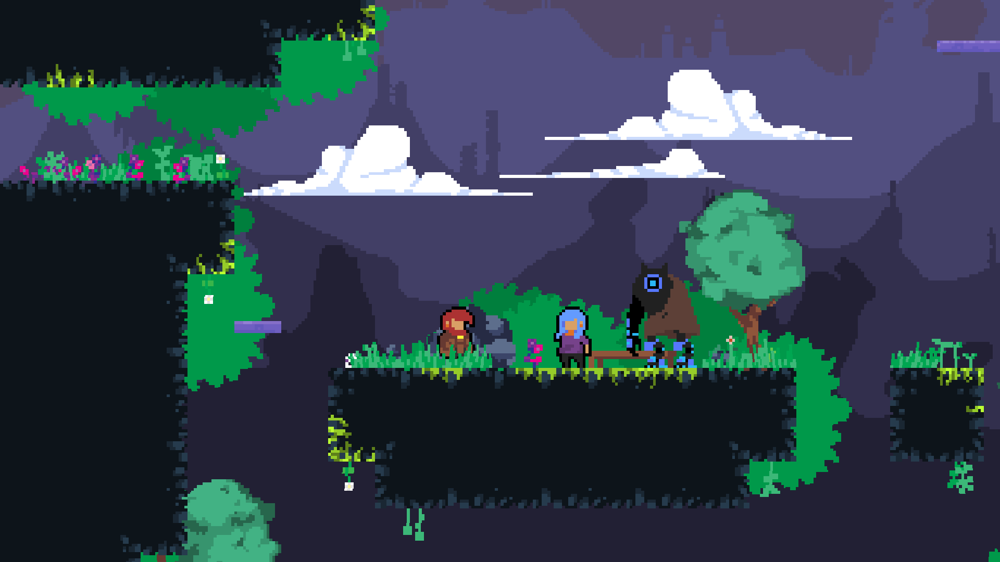
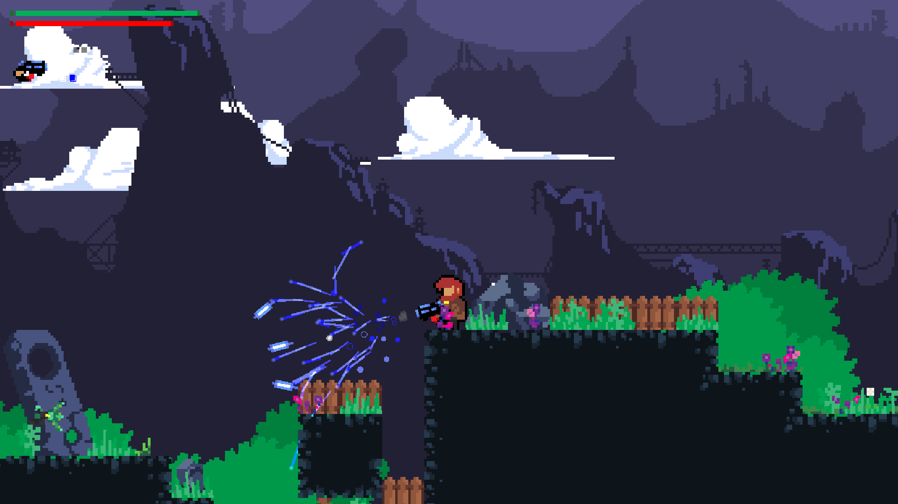

# :rocket: Platform Shooter Demo

> This project is a Demo made with [GameMaker Studio 2](https://www.yoyogames.com/).

Feel free to use any pixelart or piece of code if you need it, this is an *abandoned* project! :)

## :camera: Screenshots

| Screen 1  | Screen 2 |
| ------------- | ------------- |
|   |   |

## :beetle: Issues
You can trace the status of known issues [here](https://github.com/gilbertndr/PlatformDemo/issues),
also feel free to open a new issue (helpful description, log and images are appreciated), or send me an [email](mailto:gilbert.ndresaj@gmail.com) if you have any questions.

## :scroll: Licensing
This Project is licensed under the [Mit License](https://github.com/gilbertndr/PlatformDemo/blob/master/LICENSE).
